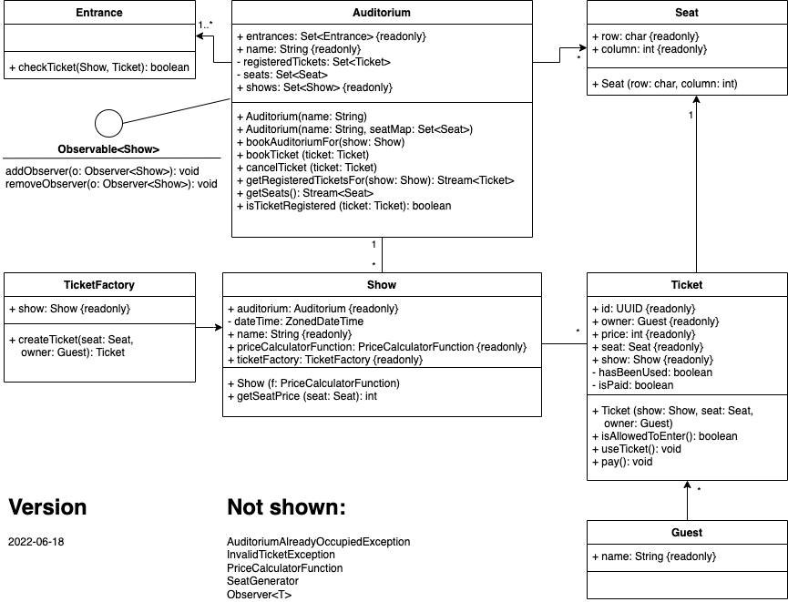

# PROG2-Probeprüfung-Ticketing

## Einführung
In diesem Projekt ist ein einfaches Ticketing-System für *Show*s (Vorführungen) realisiert.
Es dient als Basis für Prüfungsaufgaben in den verschiedenen Bereichen von PROG2 (concurrency, gui, testing,io, functional).

Die Funktionsweise des Systems ist in *BasicTest* "dokumentiert". 
Die Tests können mit `gradle test` ausgeführt werden.

## Klassendiagramm

